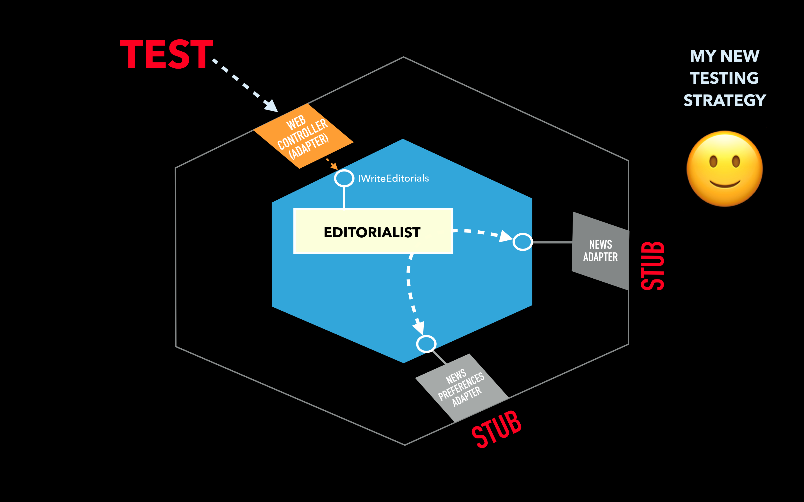

# Hexagonal Architecture sample

__Thomas PIERRAIN__

This solution is used to support various hands-on labs built and used for one of our DDD training course with Bruno (and Kenny)

The "__Hexagonal__" branch of this repo hosts a typical Hexagonal Architecture structure. 

## Description of the solution

Here are the projects of this solution:

 - __SeatsSuggestions.Domain__: the project hosting the core domain of Theater Seat Suggestions with:
  
   - __[IRequestSuggestions](./SeatsSuggestions.Domain/Ports/IRequestSuggestions.cs)__: the left-side port to enter the hexagon
   
   - __[IProvideUpToDateAuditoriumSeating](./SeatsSuggestions.Domain/Ports/IProvideUpToDateAuditoriumSeating.cs)__: the right-side port to leave the hexagon
   
   - __[SeatAllocator](./SeatsSuggestions.Domain/SeatAllocator.cs)__ the *Hexagon* (implementing the __IRequestSuggestions__ left-side port)
   
   - __[The rest of our core domain](./SeatsSuggestions.Domain/)__
   
 
 - __SeatsSuggestions.Infra__: the project hosting some infrastructure-level types such has the "AuditoriumSeatingAdapter" right-side Adapter (implemdenting the IProvideUpToDateAuditoriumSeating port). One can notice that we could have put all this project's content within the __SeatsSuggesion.Api__ one.
 
   - __[Adapter/AuditoriumSeatingAdapter](./SeatsSuggestions.Infra/Adapter/AuditoriumSeatingAdapter.cs)__: the right-side Adapter that will produce __AuditoriumSeating__ instances from 2 other Bounded Contexts (__AuditoriumLayout.Api__ and __SeatReservations.Api__ as described below) 

 
 - __SeatsSuggestions.Api__: the ASP.NET core project hosting the web controllers (our left-side adapter here), the swagger doc, etc.
 
   - __[SeatsSuggestionsController](./SeatsSuggestions.Api/Controllers/SeatsSuggestionsController.cs)__: the Web Controller that will act as our left-side Adapter to enter into the *Hexagon*.

 
 - __SeatsSuggestions.Tests__: the project containing all the tests. The coarse-grained Acceptance tests (the outer loop), the fine-grained unit tests (the inner loop). So far there is some integration tests but they should be more and located in a dedicated project IMO (TBD) 
 
--- 

The solution also contains 2 web APIs supported by other teams / other Bounded Contexts: 

 - __AuditoriumLayout.Api__: the web API providing the topology of an auditorium giving the identifier of a Show. This web API belongs to the *Auditorium topologies* Bounded Context (the one knowing in relation with all the Theaters involved in Shows). 
 
 - __SeatReservations.Api__: the web API providing the list of already reserved seats for a given Show. This web API belongs to the *Reservation* Bounded Context (the one dealing with the Booking Transactions).
 
 
 

## About the testing strategy

This solution also illustrates the testing strategy that I described __[in my blog post here](http://tpierrain.blogspot.com/2020/03/hexagonal-architecture-dont-get-lost-on.html)__.

This testing strategy includes the usage of all the Adapters within the coarse-grained Acceptance tests, stubbing only the last-miles I/Os (here Http calls to external web APIs) so that we are able to catch all the tiny mistakes and bugs one can have within the right-side Adapters (here only one: the __AuditoriumSeatingAdapter__ and all its collaborators:  *SeatReservationsWebClient* and *AuditoriumWebRepository*).

My old testing strategy for the coarse-grained Acceptance tests :

 

My new testing strategy for the coarse-grained Acceptance tests (i.e. the one in place in that __'Hexagonal' branch__:

 

